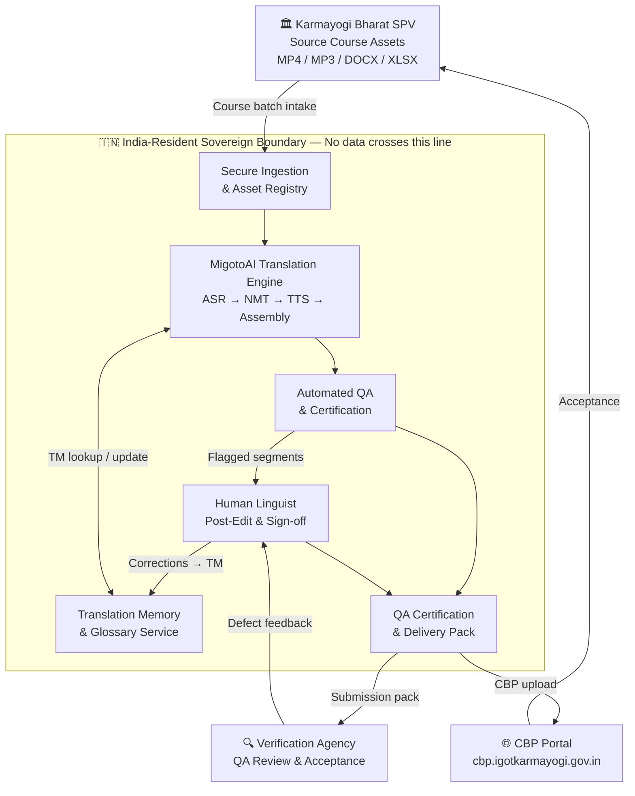
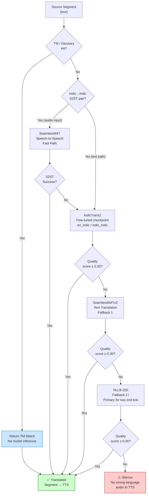
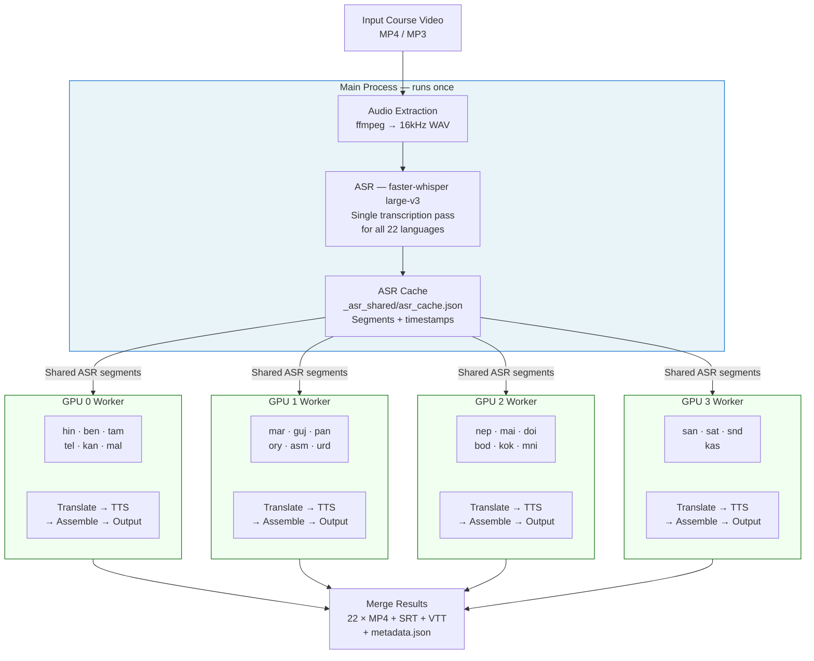
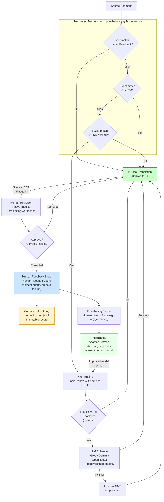
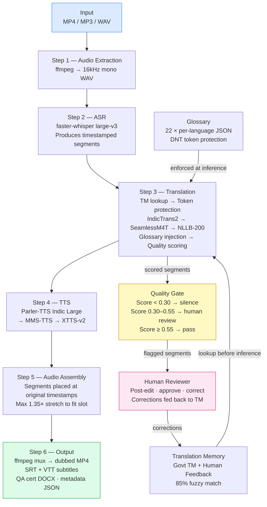
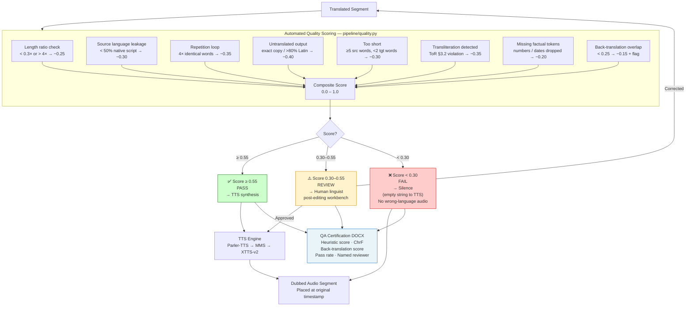

# Technical Write-Up: AI-Assisted Translation Technologies for Indian Languages

### MigotoAI Translation Engine — Novac Technology Solutions Pvt. Ltd. (Immerz Division)

### RFB No. IN-KBL-543730-NC-RFB | iGOT Karmayogi Platform — Karmayogi Bharat (SPV)

---

## 1. Executive Summary

Novac Technology Solutions proposes to deliver all translation and dubbing requirements of the iGOT Karmayogi platform using the **MigotoAI Translation Engine** — a proprietary, India-sovereign, end-to-end AI localisation system built and operated by the Immerz Division of Novac.

The MigotoAI Translation Engine is not an integration layer over public translation APIs. It is a purpose-built, closed-loop media localisation pipeline that runs Novac-owned, domain-fine-tuned neural models for Indic ASR (Automatic Speech Recognition), Neural Machine Translation (NMT), and neural Text-to-Speech (TTS), orchestrated by a multi-stage pipeline with automated quality gates and human linguist checkpoints.

**Three capabilities directly addressed by this write-up, as required under the RFB evaluation criteria:**

1. **Machine Translation** — proprietary fine-tuned model stack with three-engine fallback, factual token protection, and language-aware routing for all 22 scheduled Indian languages.
2. **Contextual Post-Editing** — Translation Memory with exact and fuzzy matching, optional LLM-based post-edit enhancement, and a structured human review and correction loop that feeds back into model training.
3. **Glossary and Terminology Management** — per-language domain glossaries enforced at inference, a Do-Not-Translate (DNT) registry for protected entities, and a government Translation Memory seeded with verified administrative terminology.

All components run locally on India-resident infrastructure. No KB course content is transmitted to any external API, cloud service, or third-party model at any stage.



---

## 2. Machine Translation

### 2.1 Engine Architecture — Three-Layer Fallback Chain

The translation core of MigotoAI is built on three sequential engines. Each engine is attempted in order; if the primary produces output below the quality threshold or is unavailable for a given language pair, the system automatically falls through to the next:

**Layer 1 — IndicTrans2 (Primary)**
AI4Bharat's IndicTrans2, fine-tuned by Novac on domain-specific Indian administrative, governance, civil-service training, and Mission Karmayogi-adjacent corpora. This is the primary engine for 19 of the 22 target languages. The fine-tuned checkpoints are maintained at `checkpoints/indictrans/en_indic/best/` (English → Indic), `indic_en/best/` (Indic → English), and `indic_indic/best/` (Indic → Indic), and are loaded preferentially over the base model weights.

**Layer 2 — SeamlessM4Tv2 (First Fallback)**
Meta's SeamlessM4Tv2 serves two roles: (a) text translation fallback when IndicTrans2 output fails quality scoring, and (b) a Speech-to-Speech (S2ST) fast-path for Indic-to-Indic pairs (`hin/ben/kan/tel/urd`), which bypasses the ASR → translate → TTS chain entirely when a direct voiced output is available — reducing latency and preserving natural prosody for those pairs.

**Layer 3 — NLLB-200 (Final Fallback)**
Meta's No Language Left Behind 200-language model serves as the final fallback, and as the primary engine for three languages (Kashmiri, Sindhi, Konkani) where its coverage exceeds IndicTrans2's.

**Language routing table:**

| Language Group                                                                 | Primary                          | Fallback 1               | Fallback 2 |
| ------------------------------------------------------------------------------ | -------------------------------- | ------------------------ | ---------- |
| hin, ben, tam, tel, kan, mal, mar, guj, pan, ory, asm, urd, nep, mai, doi, bod | IndicTrans2 (fine-tuned)         | SeamlessM4T              | NLLB-200   |
| mni, sat, san                                                                  | IndicTrans2 via Hindi pivot      | NLLB-200                 | —         |
| kok, snd, kas                                                                  | NLLB-200 (primary)               | —                       | —         |
| S2ST pairs (hin↔ben↔kan↔tel↔urd)                                           | SeamlessM4T direct speech output | Full ASR→NMT→TTS chain | —         |



### 2.2 Domain Fine-Tuning

The IndicTrans2 base model is adapted using Novac's curated parallel training corpus stored at `datasets/parallel/<lang_code>/` with `train.jsonl`, `dev.jsonl`, and `test.jsonl` splits for all 22 languages. Fine-tuning uses the `finetune/finetune_indictrans.py` script with DeepSpeed ZeRO-3 configuration (`finetune/ds_zero3.json`) for multi-GPU training.

Domain adaptation ensures that:

- Indian administrative register, honorifics, and scheme names are handled natively rather than literally transliterated
- Course-specific terminology introduced through the Glossary and Translation Memory is reflected in model outputs
- Human post-edit corrections are captured as supervised training pairs and folded back into the adapter refresh cycle, so accuracy improves continuously across the contract period

### 2.3 Factual Token Protection

A key failure mode in MT for educational content is corruption of numbers, dates, currency, measurements, and statutory references during translation. MigotoAI implements a three-tier token protection system applied before any text reaches a translation engine:

**Factual tokens** — integers, decimals, percentages, years, ordinals, dates (DD/MM/YYYY, ISO, Month-name), times, and currency amounts (`₹/$`) are detected by regex and replaced with indexed placeholders (`__F0__`, `__F1__`, ...) before translation. The original values are restored verbatim after translation. This guarantees that "₹15,000" does not become "₹15000" or a transliteration, and that "2024-03-31" survives unchanged in any target language.

**Non-translatable tokens** — URLs, file paths, shell commands, code identifiers, email addresses, hashtags, `@mentions`, and filenames are replaced with `__NT0__`, `__NT1__`, ... placeholders. These pass through the translation engine invisible and are restored post-translation.

**Format / template tokens** — programming placeholders (`{name}`, `%s`, `${value}`, `{{jinja}}`, `<PLACEHOLDER>`) are protected with `__FMT0__`, `__FMT1__`, ... to prevent translation engines from corrupting interpolation syntax in translated UI strings, quiz templates, and metadata fields.

Segments where ≥ 90% of non-space characters belong to non-translatable tokens are bypassed entirely and returned unchanged — no compute is wasted on pure-code or pure-URL segments.

```mermaid
flowchart LR
    RAW["Raw Source\nSegment"]

    subgraph PROTECT["Protection Layer — applied before any translation engine"]
        direction TB
        F["Factual Tokens\n₹15000 · 2024-03-31\n45% · 3rd · HH:MM\n→ __F0__ __F1__ ..."]
        NT["Non-Translatable Tokens\nURLs · file paths · @mentions\ncode · filenames · hashtags\n→ __NT0__ __NT1__ ..."]
        FMT["Format Tokens\n{name} · %s · ${var}\n{{jinja}} · <PLACEHOLDER>\n→ __FMT0__ __FMT1__ ..."]
    end

    CHECK{"≥90% chars\nnon-translatable?"}
    BYPASS["Pass through\nunchanged"]
    ENGINE["Translation Engine\nIndicTrans2 / Seamless / NLLB\n(sees only clean, protected text)"]

    subgraph RESTORE["Restoration Layer — applied after translation"]
        direction TB
        RF["__F0__ → ₹15000\n__F1__ → 2024-03-31"]
        RNT["__NT0__ → https://...\n__NT1__ → /path/to/file"]
        RFMT["__FMT0__ → {name}\n__FMT1__ → %s"]
    end

    OUT["Clean Translated\nSegment\nAll values intact"]

    RAW --> PROTECT
    PROTECT --> CHECK
    CHECK -->|"Yes"| BYPASS
    CHECK -->|"No"| ENGINE
    ENGINE --> RESTORE
    RESTORE --> OUT
    BYPASS --> OUT

    style BYPASS fill:#fff3cd,stroke:#cc8800
    style OUT fill:#ccffcc,stroke:#006600
```



### 2.4 GPU Batch Translation and Multi-GPU Parallelism

All pending segments for a given target language are assembled into a single GPU batch and translated in one forward pass through the NMT model, rather than one segment at a time. This is what makes the 125 output-hour peak months economically feasible.

For full 22-language course processing, MigotoAI's parallel worker architecture distributes languages across available GPUs:

- ASR runs **once** in the main process; the result is cached and shared to all language workers
- Languages are round-robin distributed (e.g., 22 languages → ~5–6 per GPU on a 4-GPU node)
- Workers use `multiprocessing.spawn` (not fork — platform-safe on Windows and Linux) with each worker assigned exclusive GPU access via the `PIPELINE_GPU` environment variable
- Workers run independently: translate → TTS → assemble, with no inter-worker dependency after the shared ASR cache handoff

This architecture means the 11 mandatory target languages can be processed concurrently on a single multi-GPU node, with the remaining 11 scheduled languages queued as the next batch.



---

## 3. Contextual Post-Editing

Contextual post-editing in MigotoAI operates at three levels: automated memory matching before inference, optional LLM-assisted post-edit after inference, and a structured human correction loop that feeds back into both the memory and the training pipeline.

### 3.1 Translation Memory (TM) — Exact and Fuzzy Matching

The MigotoAI Translation Memory (`scripts/translation_memory.py`) maintains two stores per language:

- **Government TM** (`translation_memory/govt_tm.jsonl`) — verified translations of administrative, governance, and domain-specific terms. Seeded from government reference documents and course-specific approved terminology.
- **Human Feedback store** (`translation_memory/human_feedback.jsonl`) — every correction made by a human reviewer is written here with the original wrong translation, the corrected translation, the reviewer's identity, and a timestamp. This store takes priority over the govt TM on every lookup.

**Lookup priority at inference time:**

1. Exact match in human feedback corrections (highest trust — a human already fixed this)
2. Exact match in govt TM
3. Fuzzy match at ≥ 85% similarity via `SequenceMatcher` across both stores
4. ML engine translation (if no TM hit)

When a TM hit is found before the segment reaches the NMT engine, the translation is returned directly — no model inference is needed. This enforces terminology consistency across all 61 courses and all language runs, and materially accelerates later batches as TM coverage grows.

**Correction audit trail:** Every human correction is simultaneously written to `translation_memory/correction_log.jsonl` as an immutable audit record including the source text, wrong translation, correct translation, reviewer name, and timestamp. This record supports the joint-accountability regime at Clause 5.1(D) of the ToR.

### 3.2 LLM-Assisted Post-Edit Enhancement (Optional Layer)

For segments that pass through the NMT engine without a TM hit, MigotoAI supports an optional LLM post-edit step via `pipeline/llm_enhancer.py`. This layer is activated only when an API key is configured in the environment and is explicitly disabled for air-gapped deployments.

When active, the LLM post-editor (supporting Groq / Gemini / OpenRouter as provider options, all configurable) receives the source text, the NMT-produced translation, and a prompt that instructs it to:

- Fix grammar, word order, and unnatural phrasing
- Preserve all proper nouns, scheme names, and numbers exactly as-is
- Return only the corrected translation, no commentary

Batch enhancement is supported — multiple segments are sent as a single JSON array in one LLM call, with strict output validation (array length must match input length; on mismatch, the raw NMT output is retained). The system is fault-tolerant: any LLM call failure silently falls back to the raw NMT translation, so the pipeline never blocks on the optional enhancement layer.

**Important:** The LLM enhancement layer is a post-edit assistant, not the translation engine. The NMT models are always the primary translators; the LLM only refines fluency. This distinction preserves the proprietary, offline-capable nature of the platform — the core pipeline functions fully without LLM connectivity.

### 3.3 Human Review and Correction Loop

The MigotoAI platform includes a structured human review interface (`ui/reviewer.py`, exposed as the Human Review tab in the Gradio-based platform UI) where native language reviewers can:

- Review translated segments alongside the source text
- Approve, correct, or reject individual segments
- Add inline comments
- Export a signed review certificate (DOCX) attributing review to a named reviewer

Every correction submitted through the review interface is written to the human feedback store (Section 3.1) and simultaneously captured as a supervised training pair for the model improvement loop.

**Training feedback loop:** When human feedback records are exported for fine-tuning via `export_for_finetuning()`, human-corrected pairs are upweighted 3× relative to government TM entries — reflecting the higher signal value of a domain-specific correction over a general reference translation. This ensures the model improves precisely on the failure modes it encounters in KB course content.



---

## 4. Glossary and Terminology Management

### 4.1 Per-Language Domain Glossaries

MigotoAI maintains a dedicated glossary file for each of the 22 target languages at `glossary/<lang_code>.json`. Each glossary is a curated map of English source terms to their standardised translations in the target language, covering:

- Indian administrative and governance terminology (scheme names, ministry titles, statutory terms)
- iGOT Karmayogi platform-specific vocabulary (competency framework terms, learning outcome labels)
- Civil-service training domain terms
- Technical and professional terms with approved translations

At inference time, the `GlossaryManager` (`pipeline/glossary.py`) injects glossary terms into the translation call, ensuring that approved terminology is used consistently regardless of which NMT engine handles the segment. Glossary enforcement is applied before quality scoring, so a segment using an approved glossary term is not incorrectly flagged for terminology inconsistency.

### 4.2 Do-Not-Translate (DNT) Registry

The DNT registry is implemented as part of the non-translatable token protection layer (Section 2.3). Protected entity categories include:

- Trademark and product names
- Government scheme and programme names (PMMY, PMJDY, Mission Karmayogi, iGOT, etc.)
- Statutory titles and designations
- Acronyms defined in the source
- URLs, file paths, and system identifiers
- Numeric codes, reference numbers, and measurements

DNT enforcement is deterministic — entities are masked before the text reaches any translation engine and restored verbatim after. No model sampling or probabilistic translation can alter a DNT-protected string. This is the engineering guarantee behind the claim that "scheme names and statutory titles survive translation unchanged."

### 4.3 Translation Memory as Terminology Seed

The government TM (`govt_tm.jsonl`) functions as both a translation cache and a terminology seed layer. Domain terms added to the TM via:

```
python scripts/translation_memory.py add \
  --src "Competency Framework" \
  --tgt "दक्षता ढांचा" \
  --tgt-lang hin \
  --domain government
```

...are immediately available for exact and fuzzy matching on the next pipeline run for that language, without requiring a model retrain. This allows rapid onboarding of KB-supplied terminology updates between monthly batches.

### 4.4 End-of-Contract Glossary Export

The consolidated, standardised glossary of translated terms — required as Deliverable 4.6 under the ToR — is generated by `generate_completion_report()` and included in the Completion Report DOCX with a three-column table: English Term | Language | Standardised Translation, covering all approved terms across all delivered languages.

---

## 5. Proprietary Platform — Evidence of Ownership and Capability

### 5.1 What Makes This Proprietary

MigotoAI is distinguished from off-the-shelf or API-dependent translation solutions on five dimensions:

**1. Novac-owned fine-tuned model weights**
The IndicTrans2 checkpoints used by the pipeline are not the public base model weights. They are fine-tuned checkpoint files maintained at `checkpoints/indictrans/en_indic/best/`, `indic_en/best/`, and `indic_indic/best/`. The fine-tuning pipeline (`finetune/finetune_indictrans.py`), training data (`datasets/parallel/<lang>/`), and DeepSpeed multi-GPU training configuration (`finetune/ds_zero3.json`) are Novac-developed and maintained.

**2. Custom quality scoring pipeline**
The automated quality estimation system (`pipeline/quality.py`) is a Novac-developed multi-rule scorer with eight heuristic checks, ChrF character n-gram scoring, and a back-translation semantic drift detector. It is not a third-party QE tool. The scoring thresholds (Pass ≥ 0.55, Review 0.30–0.55, Fail < 0.30) are tuned for the Indian-language administrative translation context.

**3. Proprietary token protection system**
The three-tier placeholder system (`__F__`, `__NT__`, `__FMT__`) is a Novac-built preprocessing layer. It is applied before any translation engine and restored after, across all three engines in the fallback chain. This is what guarantees factual correctness regardless of which NMT model handles a given segment.

**4. Integrated Translation Memory and correction loop**
The TM architecture (`scripts/translation_memory.py`) — including the dual-store design (govt TM + human feedback), the 85% fuzzy match threshold, the 3× correction upweighting for fine-tuning export, and the immutable correction audit trail — is entirely Novac-built.

**5. Complete offline pipeline**
The end-to-end pipeline (ASR → translate → TTS → audio assembly → subtitle generation → output packaging → CBP upload) runs with zero external API calls. All model weights are local. This is what satisfies GoI data residency requirements without any architectural compromise.

### 5.2 Platform Architecture Summary



### 5.3 Supported Languages and Model Coverage

All 22 constitutionally scheduled Indian languages are covered:

| #  | Language  | Code | Script     | Primary Engine         |
| -- | --------- | ---- | ---------- | ---------------------- |
| 1  | Assamese  | asm  | Bengali    | IndicTrans2            |
| 2  | Bengali   | ben  | Bengali    | IndicTrans2            |
| 3  | Bodo      | bod  | Devanagari | IndicTrans2 (brx_Deva) |
| 4  | Dogri     | doi  | Devanagari | IndicTrans2            |
| 5  | Gujarati  | guj  | Gujarati   | IndicTrans2            |
| 6  | Hindi     | hin  | Devanagari | IndicTrans2            |
| 7  | Kannada   | kan  | Kannada    | IndicTrans2            |
| 8  | Kashmiri  | kas  | Arabic     | NLLB-200               |
| 9  | Konkani   | kok  | Devanagari | NLLB-200               |
| 10 | Maithili  | mai  | Devanagari | IndicTrans2            |
| 11 | Malayalam | mal  | Malayalam  | IndicTrans2            |
| 12 | Manipuri  | mni  | Bengali    | IndicTrans2 (pivot)    |
| 13 | Marathi   | mar  | Devanagari | IndicTrans2            |
| 14 | Nepali    | nep  | Devanagari | IndicTrans2 (npi_Deva) |
| 15 | Odia      | ory  | Odia       | IndicTrans2            |
| 16 | Punjabi   | pan  | Gurmukhi   | IndicTrans2            |
| 17 | Sanskrit  | san  | Devanagari | IndicTrans2 (pivot)    |
| 18 | Santhali  | sat  | Ol Chiki   | IndicTrans2 (pivot)    |
| 19 | Sindhi    | snd  | Arabic     | NLLB-200               |
| 20 | Tamil     | tam  | Tamil      | IndicTrans2            |
| 21 | Telugu    | tel  | Telugu     | IndicTrans2            |
| 22 | Urdu      | urd  | Arabic     | IndicTrans2            |

---

## 6. Quality Assurance Framework

Quality in MigotoAI is enforced as a sequence of automated gates before any segment reaches a human reviewer, and as a set of human sign-off checkpoints before any deliverable leaves the platform.

### 6.1 Automated Quality Scoring

Every translated segment is scored 0–1 by `pipeline/quality.py` using the following checks:

| Check                   | What It Detects                                                                 | Score Penalty |
| ----------------------- | ------------------------------------------------------------------------------- | ------------- |
| Length ratio            | Translation < 0.3× or > 4× source word count (truncation or repetition)       | −0.25        |
| Source language leakage | < 50% native script characters in output (source language bleed-through)        | −0.30        |
| Repetition loop         | Four or more identical consecutive words (NMT hallucination)                    | −0.35        |
| Untranslated output     | Exact copy of source, or > 80% Latin characters for a non-Latin target script   | −0.35–0.40  |
| Too short               | Source ≥ 5 words but translation < 2 words                                     | −0.30        |
| Transliteration         | Latin-script rendering of an Indian-language text (directly violates ToR §3.2) | −0.35        |
| Missing factual tokens  | Numbers, dates, or measurements present in source but absent in translation     | −0.20        |
| ChrF                    | Character n-gram F-score (informational; used in QA reports)                    | —            |

For formal QA certification reports, `score_segment_full()` additionally runs back-translation: the translated segment is translated back to the source language, and word overlap is measured. A back-translation overlap below 0.25 adds a further −0.15 to the segment score and flags it for mandatory human review.

### 6.2 Quality Gate Thresholds

| Score        | Status      | Action                                                                                |
| ------------ | ----------- | ------------------------------------------------------------------------------------- |
| ≥ 0.55      | ✅ Pass     | Accepted for TTS                                                                      |
| 0.30 – 0.55 | ⚠️ Review | Flagged for human reviewer                                                            |
| < 0.30       | ❌ Failed   | Segment silenced — TTS receives empty string; no wrong-language audio is synthesised |

The silence-on-fail behaviour is a deliberate design choice: it is preferable to deliver a video with a brief silent gap than to deliver a video where a Tamil TTS voice reads English text or a transliterated string.



### 6.3 Human Review and Certification

Every delivered course package includes:

- **QA self-certification DOCX** — auto-generated by `generate_qa_report()`, containing heuristic score, ChrF score, back-translation score, pass rate, and a signed certification checklist covering linguistic accuracy, terminology consistency, content guidelines, audio-text sync, technical format, and mixed-language absence.
- **Human review certificate** — exported from the reviewer interface, attributing named reviewer sign-off to each approved segment.
- **Correction & Closure Report** — generated by `generate_correction_report()` per ToR Deliverable 4.5.iv, documenting each verification-agency-flagged issue, the corrective action taken, and the closure status.

### 6.4 Duration Compliance

The ToR §5.1B requires that dubbed output must not exceed 20% of the original duration. MigotoAI enforces this at two levels:

- **TTS synthesis level:** audio that overruns its source timestamp slot is time-stretched at up to 1.35× playback speed, then hard-trimmed if still over — the segment never exceeds its allotted window.
- **Output level:** after final assembly, the ratio of dubbed output duration to original duration is computed and written to the metadata JSON. A ratio exceeding 1.20 sets a `duration_ratio_kb_approval_required: true` flag in the delivery metadata, which is surfaced in the submission report and triggers the KB approval process before the deliverable is accepted.

### 6.5 Content Compliance

The pipeline includes automated exclusion detection for content categories that must not be translated per ToR §3.1:

- Speeches by the Prime Minister or President of India (pattern-matched against speech/address attribution in the transcript)
- YouTube-origin media without a source file (URL pattern detection)

Excluded content produces an auditable exclusion manifest per course per language, written to the metadata JSON and surfaced in the submission report.

---

## 7. Build Status — Operational vs. In Delivery

The following table is for **internal reference**. It maps the full MigotoAI platform specification (as presented to the client) to what is currently operational in the codebase, and what remains to be built before the full platform description is accurate end-to-end.

| Component                                        | Document Claim                               | Status           | Notes                                                                                                                                             |
| ------------------------------------------------ | -------------------------------------------- | ---------------- | ------------------------------------------------------------------------------------------------------------------------------------------------- |
| IndicTrans2 fine-tuned MT                        | Fine-tuned Novac-owned checkpoints           | ✅ Built         | Checkpoints at`checkpoints/indictrans/*/best/`                                                                                                  |
| SeamlessM4T fallback + S2ST                      | Second engine + Indic S2ST fast-path         | ✅ Built         | S2ST for 5 languages                                                                                                                              |
| NLLB-200 fallback                                | Third engine                                 | ✅ Built         | Primary for kas/snd/kok                                                                                                                           |
| Token protection (factual/NT/format)             | Three-tier placeholder system                | ✅ Built         | `translator.py`                                                                                                                                 |
| Translation Memory                               | Exact + 85% fuzzy, dual store                | ✅ Built         | `translation_memory.py`                                                                                                                         |
| Per-language glossaries × 22                    | Enforced at inference                        | ✅ Built         | `glossary/` + `GlossaryManager`                                                                                                               |
| Automated quality scoring                        | 8-rule heuristic + ChrF                      | ✅ Built         | `quality.py`                                                                                                                                    |
| Back-translation scoring                         | Semantic drift detection                     | ✅ Built         | `quality.py`                                                                                                                                    |
| Transliteration detection                        | ToR §3.2 compliance check                   | ✅ Built         | `quality.py`                                                                                                                                    |
| Crash-safe checkpoint/resume                     | Segment-level recovery                       | ✅ Built         | `retry.py`                                                                                                                                      |
| Multi-GPU parallel processing                    | Language workers across GPUs                 | ✅ Built         | `dub_course_parallel()`                                                                                                                         |
| Duration constraint (1.35× stretch + 20% flag)  | ToR §5.1B compliance                        | ✅ Built         | `video_processor.py` + pipeline                                                                                                                 |
| Content exclusion detection                      | ToR §3.1                                    | ✅ Built         | `_EXCLUSION_PATTERNS`                                                                                                                           |
| QA certification DOCX                            | Per ToR Deliverable 4.5                      | ✅ Built         | `generate_qa_report()`                                                                                                                          |
| Monthly / inception / completion reports         | Per ToR payment milestones                   | ✅ Built         | `dubbing_pipeline.py`                                                                                                                           |
| CBP portal upload                                | Per ToR §4.2                                | ✅ Built         | `cbp_uploader.py`                                                                                                                               |
| LLM post-edit (Groq/Gemini)                      | Optional enhancement layer                   | ✅ Built         | `llm_enhancer.py`                                                                                                                               |
| Human review UI tab                              | Basic segment review + certificate           | ✅ Built         | `ui/reviewer.py`                                                                                                                                |
| SRT + VTT subtitle generation                    | Per ToR deliverables                         | ✅ Built         | `subtitles.py`                                                                                                                                  |
| Parler-TTS / MMS-TTS / XTTS-v2                   | Three-engine TTS fallback                    | ✅ Built         | `tts.py`                                                                                                                                        |
| Voice cloning                                    | Tier 2 pricing, consented                    | ✅ Built         | `voice_clone.py`                                                                                                                                |
| **Source separation (speech vs M&E stem)** | FC-04: preserve background music             | ❌ Not yet built | Currently strips full audio. Need`demucs` or `spleeter` integration                                                                           |
| **Speaker diarization**                    | FC-03: multi-speaker ASR                     | ❌ Not yet built | faster-whisper alone does not do diarization. Need`pyannote.audio`                                                                              |
| **Full CAT-style post-editing workbench**  | FC-10: bilingual grid + video sync + TM pane | ⚠️ Partial     | Current reviewer tab is basic. Full workbench with in-context video playback, tracked changes, and role-based approval workflow needs to be built |
| **COMET-class reference-free QE**          | L5: COMET QE scoring                         | ⚠️ Partial     | Current scorer is custom heuristic. COMET (`unbabel-comet`) can be added as an additional scoring pass                                          |
| **Document-level context carry-over**      | FC-05: cross-segment coherence               | ❌ Not yet built | Segments currently translated independently. Need sliding context window                                                                          |
| **LoRA / QLoRA per-language adapters**     | 3.3.1: parameter-efficient fine-tuning       | ⚠️ Partial     | Full fine-tuning exists. LoRA adapter script needs to be added                                                                                    |
| **INT4 quantized NMT / TTS models**        | 3.3.2: INT4/GGUF compression                 | ⚠️ Partial     | ASR uses INT8 (faster-whisper). NMT/TTS quantization to INT4 not yet done                                                                         |
| **SLA Command Centre dashboard**           | FC-18: live capacity/SLA dashboard           | ❌ Not yet built | Current UI has Live Logs tab only. Full capacity dashboard with language-level burn-down and SLA clock is a separate build                        |
| **Dignitary voice recognition**            | FC-02: speaker ID against reference set      | ❌ Not yet built | Current exclusion is pattern-matching on transcript text only. Actual speaker recognition needs a voice fingerprint model                         |
| **On-screen text detection (OCR)**         | L2: shot/scene + OCR detection               | ❌ Not yet built | Not in current pipeline                                                                                                                           |
| **Objectionable content filter**           | FC-09: hate speech / profanity filter        | ❌ Not yet built | Currently no content moderation layer                                                                                                             |

---

*Document prepared by: Novac Technology Solutions Pvt. Ltd. — Immerz Division*
*Platform: MigotoAI Translation Engine*
*Reference: RFB No. IN-KBL-543730-NC-RFB | iGOT Karmayogi Platform*
